# Résumé
L'**Application Bank Account** est application orientée microservices avec des microservices **métiers** et des services **transverses**.
Chaque microservice métier est implémenté dans une **architecture hexagonale**, des tests unitaires sont écrites pour garantir la qualité du code source.
 
## Partie Backend
 3 applications microservices métiers:
    - exalt-business-microservice-customer, 
    - exalt-business-microservice-bank-account,
    - exalt-business-microservice-operation

- 1 application microservice pour la sécurité:
    - exalt-business-ms-spring-security-aouth2-resource-server

- **3 api microservices transverses**: 
    - exalt-microservices-configuration-server,
    - exalt-microservices-registration-server qui sera remplacé plus tard après intégration de **kubernetes**,
    - exalt-gateway-service-proxy qui sera remplacé plus tard par un **ingress-controller** de **K8s**

- **infrastructure kafka**: pour la persistance et la distribution des événements kafka
    - un zookeeper-server,  
    - 2 kafka-servers
    - un schema-registry-service 
    - un kafka UI

- Tout l'ecosystème des applications de **Bank Account** sont containeurisées avec **docker** et déployés ensuite dans un cluster locale **Minikuke** avec **Kubernetes**
- Après, je déploie tous ces containers docker de **Bank Account** dans un cluster **Kubernetes de Google Cloud** avec **Gcloud** et **Kubectl**

## Partie Frontend

**Application angular version 16**:
- Pattern observable avec **RxJs**
- Gestion observable liés aux événements de click
- Design graphique avec **PrimeNG**


# 💰 **Bank Account Application** 💰
- ***assets*** contient les images utilisées dans cette documentation
- ***exalt-backend*** contient 3 types de microservices de l'application Bank Account: ***3 microservices business***, ***1 scurity microservice***  et ***3 microservices utils***
- ***configuration-center*** est un dossier externe contenant les fichiers de configuration des microservices
- ***exalt-frontend*** contient l'application frontend angular
- ***docker-compose-images-template.yml*** est un template de lancement de tous les containers de l'application **Bank Account**
- ***kubernetes*** contient tous les fichiers de deploiement des containers docker de l'application **Bank Account** dans le cluster **Minikube** et dans le cluster **Google Cloud**.

# BankAcount App Backend

- **Bank Account** est implémentée en **application orientée microservices** avec des ***microservices métiers***, un **microservice pour la sécurité** et des ***microservices transverses***
- Les microservices métiers: ***customer***, ***bank-account*** et ***operation***
    - chaque microservice métier est implementé dans une achitecture ***hexagonale***
    - chaque microservice métier définit un décoder de jeton JWT: **JWT Decoder** et **Filter Chain** pour la sécurité de ses apis qu'il expose
    - les microcroservices (***customer api*** , ***bank-account api***) communiquent (voir l'architecture): 
        - c-à-d un **bank-account api** envoie la requête à **customer api** pour récuper les données d'un **customer** dont il a besoin. 
        - avec le systeme de sécutité mis en en place,  **customer api** intercepte la requête de **bank-account api** pour vérifier le JWT contenu dans la requête en utilisant un **Request Interceptor**
    - les microcroservices (***bank-account api*** , ***operation api***) communiquent: c-à-d une **operation** a besoin des données d'un **bank-account** pour être géré:
        - c-à-d un **operation api** envoie la requête à **bank-account api** pour récuper les données d'un **account** dont il a besoin (voir l'architecture): 
        - avec le systeme de sécutité mis en en place,  **bank-account api** intercepte la requête de **operation api** pour vérifier le JWT contenu dans la requête en utilisant un **Request Interceptor**
    - chaque microservice métier possède ses propres ressources (**db**,**dépendances**, **configurations**, ..), il peut évoluer dans son propre env 

- Le microservice de ***security api*** pour assurer la sécurité des apis exposés par les microservices métiers:
    - il définit des users et leurs rôles
    - authentifie un utilisateur et autorise l'accès à l'api backend selon son rôle (authority)

- Les microservices utilitaires: , ***configuration-server***, ***registration-server*** et ***gateway-service***
    - *configuration-server*: pour externaliser et distribuer les configurations aux autres microservices
    - *registration-server*: pour l'enregistrement et le loabalancing des microservices
        - ce service sera enlevé parce que j'utilise **Kubernetes** et ce dernier possède son **service d'enregistrement** et de **loadbalancing**
    - *gateway-service*: pour router dans les deux sens les requêtes entre le front et le back
        - ce service sera enlevé parce que j'utilise **Kubernetes** et **ingress-controller** qui joue le role de gateway

- Le frontend est une ***application en Angular***

# Architecure initial
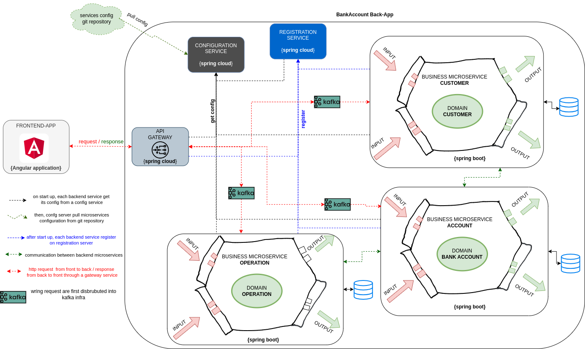

# Conceptual model
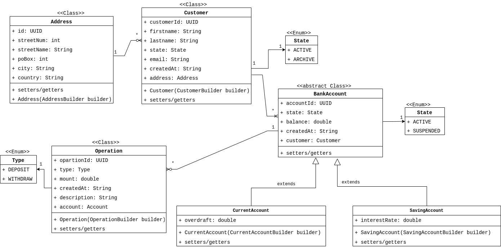

L'application orientée microservice **Bank Account** est dimensionnée comme suit:

# Backend
- 3 business microservices ou microservices métiers: **bankaccount**, **customer** et **operation**
- 1 business microservice de sécurité: **security-service** pour gérér les **users** et les **roles**
    - les business-microservice et le security-service mappent une base données ***MySQL*** déployée dans  un ***docker container***
- 3 utils microservices ou microservices transverses: **configuration-service**, **registration-service** et **gateway-service-proxy**
    - plus loin, **registration-service** et **gateway-service-proxy** seront remplacés par kubernetes (pour l'**enregistrement**, le **loadbalancing** et **ingress-controller**)

## Business microservices

- ***exalt-business-microservice-customer***
    - *exalt-backend/business-micorservices/exalt-business-microservice-customer*
- ***business-microservice-bankaccount***
    - *exalt-backend/business-micorservices/exalt-business-microservice-bankaccount*
- ***business-microservice-operation***
    - *exalt-backend/business-micorservices/exalt-business-microservice-operation*

## Kafka infrastructure
le données des requêtes d'écriture dans la base de données pour chaque business-microservice (**customer**, **bank-account** et **operation**)sont persistées et distribuées dans une **infrastructure Kafka**:
- **un zookeeper-server**,  
- **2 kafka-servers**
- **un schema-registry-service** : pour définir le schéma de données en envoyer dans des topics Kafka
    - j'utilise **avro** comme modèle de données
- **un kafka UI** (kafdrop): pour visualiser les événements dans des topics Kafka

## Security microservice
- ***exalt-business-ms-spring-security-aouth2-resource-server***
    - *exalt-backend/security-micorservice/exalt-business-ms-spring-security-aouth2-resource-server*

## Utils microservices

- ***exalt-microservices-configuration-server***: *exalt-backend/utils-microservices/exalt-microservices-configuration-server*
    - au démarrage, les microservices demandent leur configurations au serveur **exalt-microservices-configuration-server**
    - le serveur de configuration récupère les config depuis le git repo dans le dossier ***configurations-center*** et les distribuent aux microservices
- ***microservices-registration-server***: *exalt-backend/utils-microservices/microservices-registration-server*
    - enregistrement des microservices dans l'annuaire
    - loadbalancer les microservices
    - les services enregistrés dans l'annuaire sont visionnés ici: ```http://localhost:8761```
- ***exalt-gateway-service-proxy***: *exalt-backend/utils-microservices/exalt-gateway-service-proxy*
    - le service gateway route les requêtes http dans les deux sens entre le frontend et la backend
    - voir la configuration ***bootstrap-dev.yml*** du microservice 


## Les api exposeés par les business microservices et sucurity microservice

Pour accéder au **business microservices** et au **security microservice** en backend on passe par la ***gateway-service-proxy*** : ```http://localhost:8101```

### exalt-business-ms-spring-security-aouth2-resource-server
- **[POST]**: ```http://localhost:8101/api-security/users```:  **créer** un user  
request payload ->   response ->    
    - le user ne doit pas exister déjà
    - le mail ne doit pas être possédé par un autre user
    - 
- **[POST]**: ```http://localhost:8101/api-security/roles```: **créer** un role  
    - le role ne doit pas exister déjà
    - le role doit être parmi une liste prédéfinie
request payload ->   response ->    
- **[POST]**: ```http://localhost:8101/api-security/users/add-role```, ```http://localhost:8101/api-security/users/remove-role```: **affecter** un role à un user  
request1 ->  request2->   response ->   
    - le role doit exister
    - le user doit exister
    - ```http://localhost:8101/api-security/users/add-role```: le user ne doit pas posséder déjà ce role
    - ```http://localhost:8101/api-security/users/remove-role```: le user doit posséder ce role qu'on veut lui supprimer

- **[POST]**: ```http://localhost:8101/api-security/login```: **authentifier** et **créer** le token JWT  
equest payload ->   response ->    
    - le user doit être authentifié avec son username et son mot de passe  
si le jeton d'accès a expiré, le user peut s'authentifier avec son jeton de refresh:  
equest payload ->   response ->    
    - le user doit être authentifié avec son jeton de refresh
    - le jeton de refresh doit être valide  

- Toutes les autres requêtes vers le **security microservice** et vers les **business microservices** suivants doivent être authentifiées avec le **JWT access token**
- Selon la security policy mise en place dans le **microservices métiers**, seul les users avec les autorités **Admin**, **HR** et **CTO** ont le droit d'accès aux méthodes **POST** et **PUT**

### exalt-business-microservice-customer

- **[POST]** / **[PUT]**: ```http://localhost:8101/api-customer/customers```: **créer** / **éditer** un customer  
request payload -> 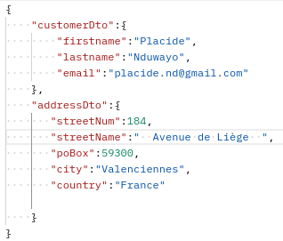    request response ->   
    - si adresse existe déjà (c-à-d un customer est déja enregistré à cette adresse), enregistrer le nouveau customer à cette même adresse
    - si adresse n'existe pas, créer la nouvelle adresse et enregistrer le customer à cette adresse
- **[GET]**: ```http://localhost:8101/api-customer/customers```: **consulter** tous les customers  
- **[GET]**: ```http://localhost:8101/api-customer/addresses```: **consulter** les adresses des customers  
- **[POST]**: ```http://localhost:8101/api-customer/customers/switch-state```: **archive** ou **active** un customer  
payload -> 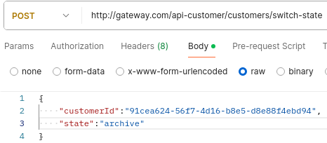  response -> 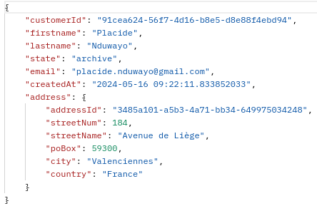  
les conditions à être remplies pour que la request réussisse:
    - le customer existe
    - le state fourni dans la request est valide (**active** ou **archive**)
    - le state fourni dans la request est différent du state du customer pour lequel on veut changer le state

### exalt-business-microservice-account

- **[POST]** / **[PUT]**: ```http://localhost:8101/api-bank-account/accounts```: **créer** / **éditer** un bank account  
    - **bank-account api** intérroge le remote **customer api** pour récupérer les infos du customer associé au ***customerId*** fourni par le bank account api
    - remote **customer api** intercepte la requête de **bank-account api** pour checker le JWT afin d'authentifier et autoriser le **user** de **bank-account api**
    - le **user** doit avoir l'autorité soit **Admin**, **HR** ou **CTO**
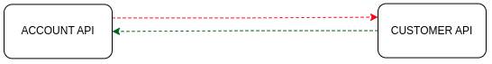  
payload -> 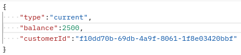 response -> 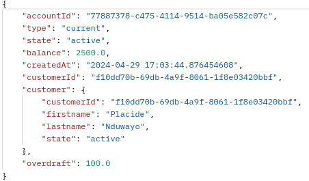   
l'api **bank account** verifie que:
    - le remote ***customer api*** est joignable (reachable/unreachable), sinon une business exception et une forme de relience sont retournées à l'utilisateur
    - le remote ***customer*** associé au ***customerId*** existe, sinon une business exception est renvoyée 
    - le remote customer ***state*** est **active** sinon une business exception est retournées à l'utilisateur  
- **[GET]**: ```http://localhost:8101/api-bank-account/accounts```: **consulter** la liste de tous les comptes 
- **[POST]**: ```http://localhost:8101/api-bank-account/accounts/switch-state```: **suspendre** / **activer** un bank account  
  
payload 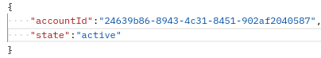 response -> 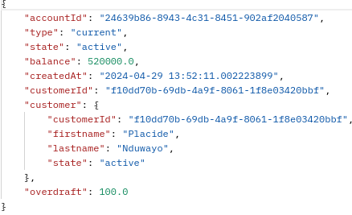  
l'api **bank account** verifie que:
    - le user (decoded JWT from http request) est soit **Admin**, **HR**, ou **CTO**
    - le compte existe
    - le compte n'est pas déjà dans le même state que le state fourni
    - le customer api de ce bank account est joignable (reachablea/unreachable) sinon une forme de résilience est renvoyée
    - le customer state est **active**

- **[POST]**: ```http://localhost:8101/api-bank-account/accounts/overdraft```: **update** le découvert d'un bank account  
  
l'api **bank account** verifie que:
    - le user (decoded JWT from http request) est soit **Admin**, **HR**, ou **CTO**
    - le compte existe
    - le compte n'est pas suspendu
    - le compte n'est pas un compte epargne
    - le ***customer api*** de ce bank account est joignable (reachablea/unreachable) sinon une forme de résilience est renvoyée
    - le customer ***state*** (active/archive) de bank account est active
- **[GET]**: ```http://localhost:8101/api-bank-account/customers/{customerId}/accounts``` : **consulter** les comptes associés au **customer** et leurs soldes 
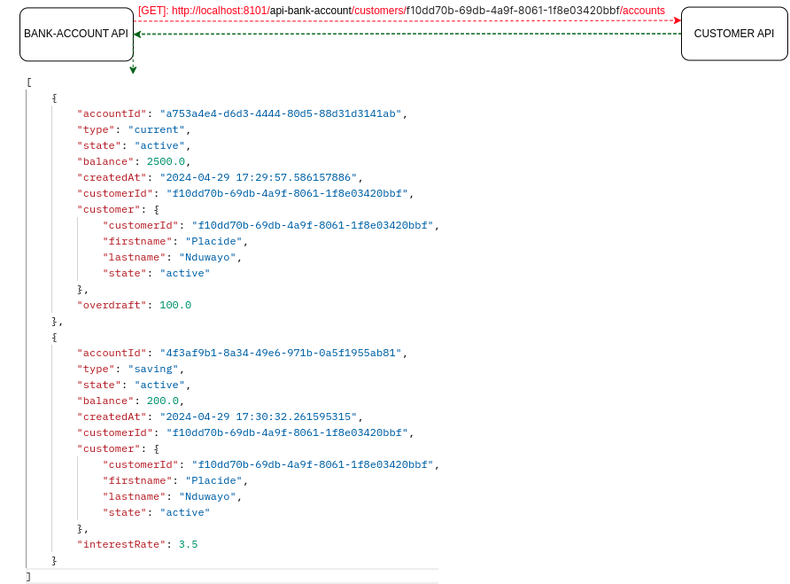  

### exalt-business-microservice-operation
- **[POST]**: ```http://localhost:8101/api-operation/operations```: **créer** une opération de **dépot** ou de **retrait**  
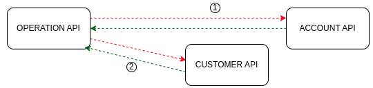  
payload -> 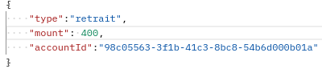   response -> 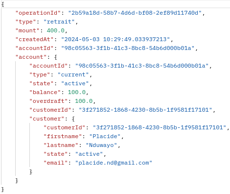  
payload -> 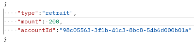   response -> 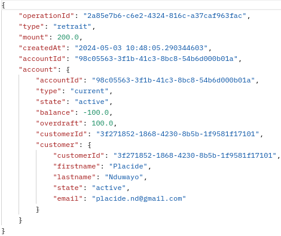  
payload -> 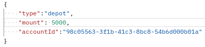   response -> 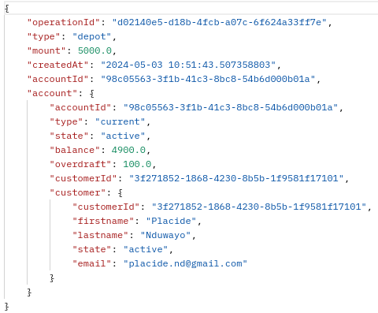  
Pour enregistrer une opération de **dépot** ou de **retrait**, l'**api operation** vérifie que: 
    - le remote api **bank-account** est joignable
    - remote **bank-account api** intercepte la requête de **operation api** pour checker le JWT afin d'authentifier et autoriser le **user** de **operation api**
    - le remote api **customer** est joignable et que le **state** du customer est **active** 
    - remote **customer api** intercepte la requête de **operation api** pour checker le JWT afin d'authentifier et autoriser le **user** de **operation api**
    - le bank-account est de type **current**
    - si opération est **retrait** vérifier que la balance est suffisante: ```account.balance + account.overdraft >= operation.amount```
        - si OK, l'**api operation** demander le **remote bank account** de mettre à jour la balance: ```account.balance = account.balance - operation.mount```
        - le remote **bank-account api** la requête de **operation api** pour checker le JWT afin d'authentifier et autoriser le **user** de **operation api**
    - si opération est de **depot**,l'**api operation** demander à le **remote bank account** de mettre à jour la balance: ```account.balance = account.balance + operation.mount```

- **[GET]**: ```http://localhost:8101/api-operation/accounts/{accountId}/operations```: **consulter** les opérations d'un compte  
l'**api operation** vérifie que:
    - le **remote api bank account** est joignable / l'id du bank account existe
    - le résultat retourné est: la **liste des opérations**, le **compte** et le **customer** associé à ce compte

- **[POST]**: ```http://localhost:8101/api-operation/operations/transfer```: **transfert** entre deux comptes origin est destination
  
payload ->   response ->   
l'**api operation** verifie que:
    - le remote **bank account** api est joignable
    - le remote **bank account origin** est **différent** du remote bank account destination
    - les remotes **bank account origin** et **destination** ne sont pas **suspended**
    - le remote **customer api** est joigable, le **state** des customers n'est pas **archive**
    - la balance du remote **bank account origin** >= mount à transférer: ```origin.getBalance()>= dto.getMount()```
    - si bank accounts origin / destination l'un est *current* et l'autre *saving*:
        - l'**api operation** vérfie que les deux comptes appartiennent au **même customer**: saving bank account accessible par son propriétaire

# La couverture du code source par les tests
## exalt-business-microservice-customer (88%,90%)     
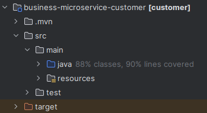

## exalt-business-microservice-bank-account (90%,87%)
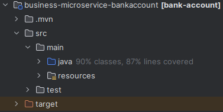

## exalt-business-microservice-operation (94%,83%)
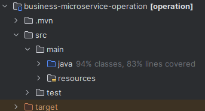 

# Deploiement en containers docker
- J'utilise l'environnement **dev**: **application-dev.yml**, **bootstrap-dev.yml** pour lancer tous les microservices du **BankAccount** en local:
    - ***http://localhost:gateway-port/api-backend/endpoint***, gateway port: ***8101***
- Après je déploie tous les microservices de **Bank Account** dans des **containers docker**
    - J'utilise pour cela l'environement **integ**: **application-integ.yml**, **bootstrap-integ.yml**
    - le fichier ***docker-compose-images-template.yml*** est un template de deploiement de tous les containers docker composant **Bank Account**
    - pour construirer (builder) les images docker de Bank Account: ```docker compose -f docker-compose-images-template.yml build```
    - après le build des images dockers, pour lancer les containers docker de ces images: ```docker compose -f docker-compose-images-template.yml up --detach```
- L'interface web Portainer permet de voir les running **Bank Account** docker **containers**:
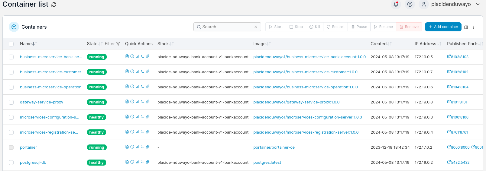

- Je déploie par la suite ces containers docker de l'application **Bank Account** dans un **Cluster Kubernetes**.  
# Orchestrer les containers docker avec Kubernetes
- Dans cette partie, je déploie les containers docker de l'application **Bank Account** dans un cluster **minikube**.
- J'utilise l'orchestrateur **Kubernetes** (K8s) pour le deploiement des containers docker de l'application **Bank Account**.
- Ce qui est bien avec Kubernetes, c'est que possédant son système de **discovery** et de **loadbalancing**, on n'a plus besoin du microservices dédié d'enregistrement et de loadbalancing. 
    - J'avais utilisé **eureka-server** comme serveur d'**enregistrement** et de **loadbalancing**
    - Dans chaque microservice qui utilisais un service d'enregistrement via **eureka-clent dependency**, on remplace cette pendance par la dépendance Kubernetes ***spring-cloud-starter-kubernetes-client-all***. Cette dernière permet le discovrey et le loadbalancing des microservices.
# Architecture finale de BankAccount App
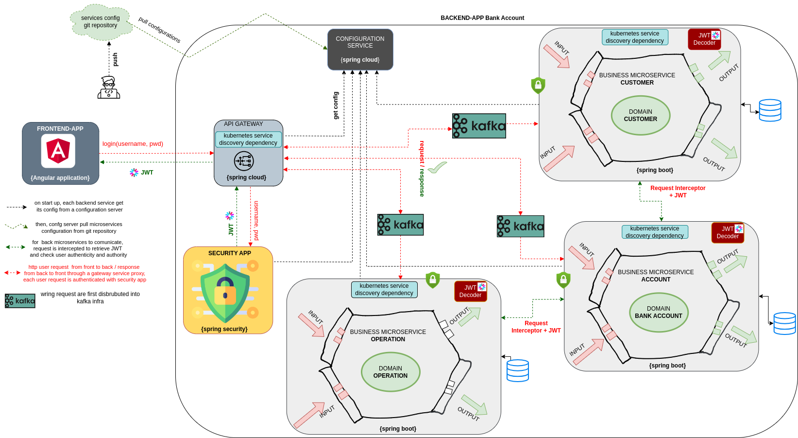  

- Les containers docker de l'application **Bank Account** déployés dans le cluster **Minikube de Kubernetes** sont:


## Ingress Controller Service
- Ingress controller va jouer maintenant le rôle d'entrée vers le backend des business-microservices: **api-security**, **api-customer**, **api-bank-account** et **api-operation**. Donc avec Ingress-controller , le service de gateway n'est plus nécessaire.
- Dans le cluster **Minikube**, je configure un service **Ingress**  avec ```minikube addons enable ingress```  pour exposer les microservices business microservices à l'extérieur.
    - Dans Kubernetes, un **Service K8s** expose un **deployment K8s**, un **Ingress Controller** expose un **Service K8s**
- Dans le fichier **kubernetes/7-k8s-ingress-nginx-controller.yaml**, je crée un **Ingress Controller** et definis les dns suivants:
    - **exalt.bs-ms.security.com**: pour le sucurity business microservice **exalt-business-ms-spring-security-aouth2-res-server**
    - **exalt.bs-ms.customer.com**: pour le customer business microservice **exalt-business-microservice-customer**
    - **exalt.bs-ms.bank.account.com**: pour le bank-account business microservice **exalt-business-microservice-bank-account**
    - **exalt.bs-ms.operation.com**: pour operation business microservice **exalt-business-microservice-operation**
    - **exalt.front.app.com**: pour l'application frontend **exalt-bank-account-angular-app**

# BankAccount App Frontend (Angular 16)
## Description
- Pattern observable avec la librairie **RxJs**
- Gestion observable liés aux événements de click
- Design graphique avec **PrimeNG**
- Dockerisation de l'application frontend dans une image docker: **exalt-bank-account-angular-app**
- déploiement dans le cluster minikube avec Kubernetes
- creation d'un ingress pour accéder à l'application front via l'url: ```http://exalt-front-app.com```

## Connexion avec le backend
injection des dns dans les variables d'environnement:
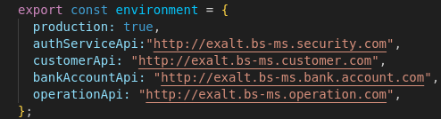

## Ingress Controller Service: exalt-gateway.com and exalt-front-app.com

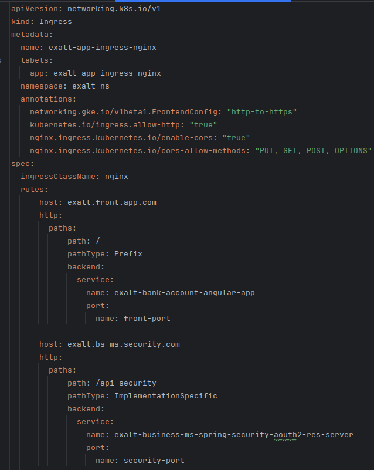 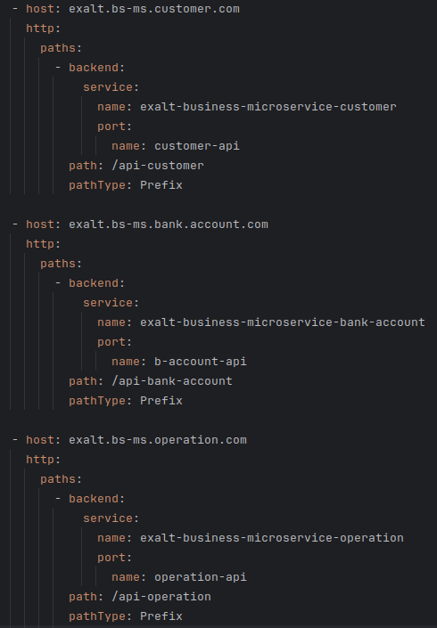 

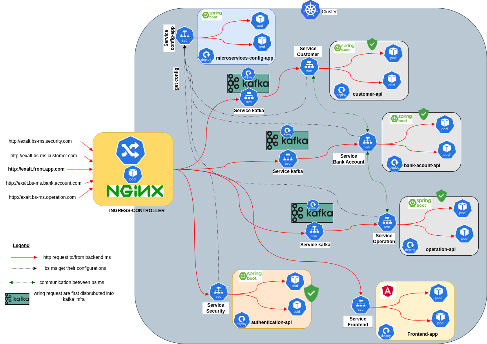